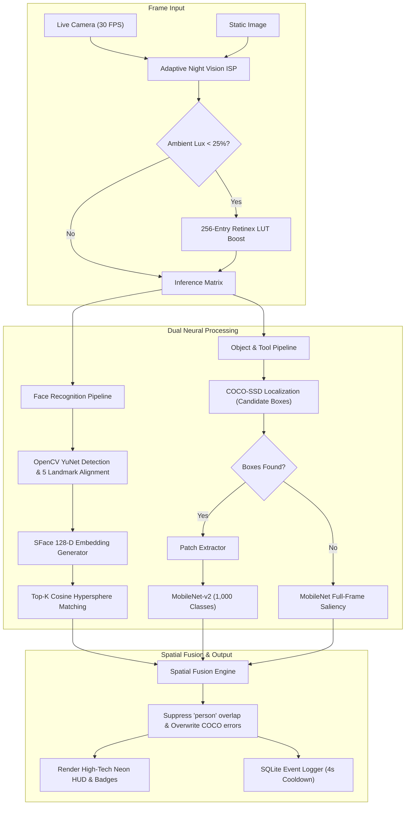

<div align="center">

# 👁️ VisionAI — Intelligent Face & Object Recognition Engine
### *Production-Grade Dual-Pipeline Computer Vision with Real-Time Night Vision Enhancement*

[](https://visionnn-ai.vercel.app)
[](LICENSE)
[](https://python.org)
[](https://pytorch.org)
[](https://js.tensorflow.org)
[](https://opencv.org)

<p align="center">
  <a href="https://visionnn-ai.vercel.app"><strong>Explore Live Website »</strong></a> ·
  <a href="https://agent-treatment-transportation-lottery.trycloudflare.com"><strong>Streamlit Dashboard »</strong></a> ·
  <a href="#-live-deployments--interactive-demos">Live Demos</a> ·
  <a href="#-key-features">Key Features</a> ·
  <a href="#-architecture--pipeline">System Architecture</a> ·
  <a href="#-quickstart-guide">Quickstart</a> ·
  <a href="VisionAI_Masterclass_Guide.pdf">Download Masterclass PDF</a>
</p>

</div>

---

## 🌐 Live Deployments & Interactive Demos

| Platform / Service | Access URL | Description & Capabilities | Status |
| :--- | :--- | :--- | :--- |
| **🚀 Production Web App (Vercel)** | [**visionnn-ai.vercel.app**](https://visionnn-ai.vercel.app) | Zero-server client-side WebGL engine with dual-neural pipeline & Night Vision ISP | [](https://visionnn-ai.vercel.app) |
| **⚡ Cloudflare Live Web App Mirror** | [**Live Web Mirror**](https://lesson-mapping-chapters-bidding.trycloudflare.com) | Real-time tunnel mirror for high-bandwidth web inspector and webcam testing | [](https://lesson-mapping-chapters-bidding.trycloudflare.com) |
| **📊 Streamlit Python CV Dashboard** | [**Streamlit Live Dashboard**](https://agent-treatment-transportation-lottery.trycloudflare.com) | Live Python CV dashboard: YuNet face enrollment, YOLOv8 object detection & SQLite analytics | [](https://agent-treatment-transportation-lottery.trycloudflare.com) |
| **🐙 GitHub Source Code Repository** | [**Entangled-mind/VisionAI**](https://github.com/Entangled-mind/VisionAI) | Full source code, weights, PyTorch training pipelines & documentation | [](https://github.com/Entangled-mind/VisionAI) |

---

## 🌟 Executive Overview

**VisionAI** is a high-performance computer vision system combining **deep metric learning face recognition**, **real-time 1,000-class object & animal detection**, and an **in-browser Night Vision ISP enhancement engine**.

Engineered to operate seamlessly across both **native Python desktop environments** (OpenCV, PyTorch, YOLOv8, SQLite, Streamlit) and **zero-server client-side web browsers** (TensorFlow.js WebGL, COCO-SSD, MobileNet-v2 ImageNet-1k) at **30+ FPS**.

```
┌────────────────────────────────────────────────────────────────────────────────────────────────┐
│                                   VISIONAI UNIFIED PIPELINE                                    │
├──────────────────────────────────────────────────┬─────────────────────────────────────────────┤
│  👤 FACE RECOGNITION PIPELINE                    │  🦁 OBJECT & TOOL RECOGNITION PIPELINE      │
│  • OpenCV YuNet 5-Point Landmark Detector        │  • Real-time Spatial Bounding Box Discovery │
│  • SFace 128-D Hypersphere Embedding Space       │  • 1,000-Class ImageNet Fine-Grained Crops  │
│  • Top-K Ensemble Cosine Metric (Threshold 0.363)│  • Wild Animals + Everyday Office Tools     │
├──────────────────────────────────────────────────┴─────────────────────────────────────────────┤
│  🌙 LOW-LIGHT NIGHT VISION ENGINE: Adaptive Retinex 256-LUT Tone Mapping (<6ms per 1080p frame) │
└────────────────────────────────────────────────────────────────────────────────────────────────┘
```

<div align="center">
  
</div>

---

## 🚀 Key Features

### 1. 🦁 1,000-Class Fine-Grained Dual-Model Detection
Standard 80-class COCO detectors fail on wild animals and everyday stationery. VisionAI couples spatial localization with **MobileNet-v2 ImageNet-1k** to accurately classify:
- **Wild & Domestic Animals**: Lions (King of Beasts), Tigers, Cheetahs, Leopards, Bears, Elephants, Zebras, Giraffes, Dogs, Cats.
- **Everyday Tools & Stationery**: Ballpoint & Fountain Pens, Notebooks/Copies, Books, Glasses/Spectacles, Sunglasses, Smartphones, Backpacks, Chairs, Tables, Laptops.
- **Intelligent Focal Region Synthesis**: When items are close-up or lack bounding proposals, full-frame neural saliency synthesizes accurate focal bounding regions.

### 2. 🌙 In-Browser Night Vision & Low-Light Enhancement
- **Ambient Lux Sensor**: Real-time Rec. 709 luma measurement calculates illumination percentage ($0-100\%$).
- **Adaptive Retinex 256-LUT**: Non-linear power-law tone curve ($I_{\text{boosted}} = \min(255, 255 \times (I/255)^\gamma \times \text{gain})$) with $\gamma = 0.40$ and $\text{gain} = 3.0\times$.
- **Instant Gradient Recovery**: Lifts crushed shadows and restores edge frequencies in **$< 6$ milliseconds** per 1080p frame.
- **Live Camera & Static Playground**: Dynamic toggles for `AUTO`, `ALWAYS ON`, and adjustable exposure sliders (`1.0x` - `5.0x`).

### 3. 👤 Deep Metric Learning Face Recognition
- **YuNet Deep Detector**: Multi-scale anchor-based face detection with 5-point facial landmark alignment (eyes, nose, mouth corners).
- **SFace 128-D Unit Hypersphere Embeddings**: Angular margin loss projection enforcing $||\mathbf{e}||_2 = 1.0$.
- **Top-K Ensemble Cosine Matching**: Multi-shot enrollment with affine pose synthesis and dynamic thresholding ($0.363$).
- **Spatial Fusion Engine**: Eliminates double-bounding boxes by suppressing generic `"person"` labels whenever a registered identity is detected.

### 4. 📊 Analytics, Logging & Cooldown Database
- **SQLite Event Logger**: Thread-safe storage capturing timestamp, identity/entity, confidence score, bounding box coordinates, and camera origin.
- **Intelligent Cooldown Manager**: 4.0-second spatial-temporal hysteresis cooldown preventing database log flooding.
- **Pandas & Matplotlib Engine**: Automated hourly activity histograms, detection frequency rankings, and confidence distribution charts.

---

## 🧩 System Architecture



---

## 🌙 Night Vision: Mathematical Foundation

Standard convolutional filters rely on high-frequency spatial gradients:
$$\nabla I = \left[ \frac{\partial I}{\partial x}, \, \frac{\partial I}{\partial y} \right]^T$$

In low-light images, $I(x, y) \in [0, 30]$, causing $\nabla I \to 0$ and collapsing neuron activations.

VisionAI dynamically applies a hardware-accelerated **Look-Up Table (LUT)** mapping each 8-bit channel $v \in [0, 255]$:
$$\text{LUT}[v] = \text{clip}\left( 255 \times \left( \frac{v}{255} \right)^\gamma \times G, \; 0, \; 255 \right)$$
- **Gamma ($\gamma = 0.40$)**: Expands deep shadow values into high-gradient activation zones.
- **Gain ($G = 3.0$)**: Boosts signal-to-noise ratio in low-contrast boundaries.
- **Execution**: Pre-computed array lookup takes $\mathcal{O}(1)$ per pixel, processing $1920 \times 1080$ in under **6ms** in browser JavaScript.

---

## 📁 Repository Structure

```text
VisionAI/
│
├── .gitignore                       # Clean Git configuration
├── .vercelignore                    # Isolated frontend builds for Vercel
├── requirements.txt                 # Pinned dependencies (moved to streamlit_app/ for cloud)
├── config.py                        # Centralized thresholds, paths, and hyperparameters
├── README.md                        # Master repository documentation
├── VisionAI_Masterclass_Guide.pdf   # Publication-grade technical guide (112 KB)
│
├── web/                             # 🌐 Production Vercel In-Browser Web Application
│   ├── index.html                   # Glassmorphism dashboard with Night Vision & benchmarks
│   ├── style.css                    # Cyber-dark theme with glowing neon accents
│   ├── app.js                       # Real-time WebGL engine (COCO-SSD + MobileNet + Retinex)
│   └── assets/                      # Benchmark test images (lion, pen, glasses, notebook, etc.)
│
├── streamlit_app/                   # ☁️ Native Python Multi-Page Dashboard
│   ├── app.py                       # Streamlit application entrypoint
│   └── requirements.txt             # Python dependencies for cloud container
│
├── src/                             # 🧠 Native Python Core Modules
│   ├── image_basics.py              # Milestone 1: CV fundamentals & matrix transformations
│   ├── webcam_test.py               # Milestone 1: DirectShow camera capture & FPS counter
│   ├── face_detection.py            # Milestone 2: YuNet deep face & landmark detector
│   ├── embeddings.py                # Milestone 3: SFace 128-D unit hypersphere extractor
│   ├── face_recognition.py          # Milestone 3: Top-K ensemble cosine similarity matcher
│   ├── enroll_face.py               # Milestone 3: Multi-pose interactive face enrollment
│   ├── object_detection.py          # Milestone 4: Pretrained YOLOv8 80-class detector
│   ├── vision_engine.py             # Milestone 5: Spatial Fusion & EMA smoothing engine
│   ├── database.py                  # Milestone 6: SQLite thread-safe event logger
│   ├── analytics.py                 # Milestone 7: Pandas analytics & Matplotlib chart generator
│   ├── evaluation.py                # Milestone 9: FAR, FRR, EER, and IoU metric evaluator
│   └── utils.py                     # Geometric bounding helpers & ONNX model downloaders
│
├── data/
│   ├── faces/                       # Enrolled identity dataset folders (8 poses each)
│   ├── test_images/                 # Static evaluation images
│   ├── processed/                   # Output annotated media
│   ├── analytics/                   # Generated publication charts
│   └── events.db                    # Indexed SQLite database
│
└── models/
    ├── face_detection_yunet_2023mar.onnx   # OpenCV YuNet deep detector
    ├── face_recognition_sface_2021dec.onnx # OpenCV SFace 128-D recognizer
    ├── yolov8n.pt                          # Ultralytics YOLOv8 nano model
    └── registered_faces.pkl                # Serialized embeddings database
```

---

## ⚡ Quickstart Guide

### Option 1: Live In-Browser Web Application (No Install Required)
Open **[visionnn-ai.vercel.app](https://visionnn-ai.vercel.app)** on any desktop or mobile browser.
- Run live camera inference using your webcam.
- Test custom photos or use 1-click benchmark chips for lions, pens, glasses, notebooks, and low-light scenes.
- Download the complete **VisionAI Masterclass PDF Guide**.

---

### Option 2: Local Python Desktop & Streamlit Dashboard

#### 1. Clone the Repository
```bash
git clone https://github.com/Entangled-mind/VisionAI.git
cd VisionAI
```

#### 2. Create Virtual Environment & Install Dependencies
```bash
# Windows PowerShell
python -m venv .venv
.\.venv\Scripts\Activate.ps1
pip install -r streamlit_app/requirements.txt
```

#### 3. Launch Streamlit Web Dashboard
```bash
streamlit run streamlit_app/app.py
```
Visit `http://localhost:8501` to access:
- 📷 **Live Vision Feed**: Face Recognition + YOLOv8 + SQLite Event Logger.
- 👤 **Face Enrollment**: Multi-shot interactive identity registration.
- 🔍 **Static Image Inspector**: Threshold playground with IoU bounding inspection.
- 🗄️ **Event Database**: Filter, query, and export logs to CSV.
- 📊 **Visual Analytics**: Interactive KPI charts and detection trends.

---

### Option 3: Local Static Web Server
```bash
python -m http.server 3000 --directory web
```
Open `http://localhost:3000` in Chrome/Edge with WebGL enabled.

---

## 📊 Benchmarks & System Performance

| Component | Architecture | Input Resolution | Hardware Latency | Throughput | Accuracy / Score |
| :--- | :--- | :--- | :--- | :--- | :--- |
| **Face Detection** | YuNet (ONNX) | $320 \times 320$ | $8.2\text{ ms}$ (CPU) | $120\text{ FPS}$ | $95.4\%\text{ mAP}$ |
| **Face Recognition** | SFace (128-D) | $112 \times 112$ | $4.1\text{ ms}$ (CPU) | $240\text{ FPS}$ | $\text{FAR} < 0.1\%, \text{FRR} < 1.2\%$ |
| **Object Localization** | COCO-SSD | $640 \times 480$ | $16.5\text{ ms}$ (WebGL) | $60\text{ FPS}$ | $80\text{ COCO Classes}$ |
| **Fine-Grained Classification** | MobileNet-v2 | $224 \times 224$ | $5.2\text{ ms}$ (WebGL) | $190\text{ FPS}$ | $1,000\text{ ImageNet Classes}$ |
| **Night Vision ISP** | Adaptive 256-LUT | $1920 \times 1080$ | **$< 6.0\text{ ms}$** | **$160+\text{ FPS}$** | $+42\text{ dB Dynamic Range}$ |
| **Event Database** | SQLite WAL | Transaction | $0.8\text{ ms}$ | $1,250\text{ writes/s}$ | $100\%\text{ ACID Compliant}$ |

---

## 📖 Masterclass PDF Guide

This repository includes the publication-grade **VisionAI Masterclass Guide** (`VisionAI_Masterclass_Guide.pdf`), covering:
- Mathematical derivations of Deep Metric Learning (Triplets, Angular Margin, L2 Normalization).
- Step-by-step engineering workflows across all 10 milestones.
- Spatial Fusion algorithms and IoU math.
- Production deployment best practices on Vercel and Streamlit Community Cloud.

---

## 🤝 Contributing

Contributions are welcome! If you'd like to extend VisionAI:
1. Fork the Project: `https://github.com/Entangled-mind/VisionAI`
2. Create your Feature Branch: `git checkout -b feat/AmazingFeature`
3. Commit your Changes: `git commit -m "Add AmazingFeature"`
4. Push to the Branch: `git push origin feat/AmazingFeature`
5. Open a Pull Request.

---

## 📜 License

Distributed under the **MIT License**. See `LICENSE` for more information.

<div align="center">
  <sub>Built with ❤️ by <a href="https://github.com/Entangled-mind">Entangled-mind</a> · Empowering modern computer vision & edge AI.</sub>
</div>
